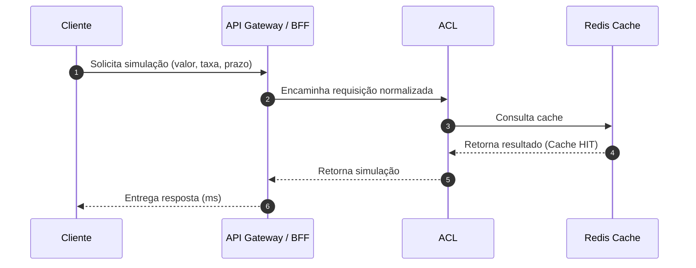

# Case: Coordenador de Engenharia de Software – Corporativo (Interno)

<!-- TOC -->

- [Case: Coordenador de Engenharia de Software – Corporativo (Interno)](#case-coordenador-de-engenharia-de-software--corporativo-interno)
- [Cenário](#cenário)
  - [Perguntas](#perguntas)
  - [Informações Importantes](#informações-importantes)
- [Solução](#solução)
  - [1. Desenho de solução](#1-desenho-de-solução)
  - [2. Estratégia de modernização](#2-estratégia-de-modernização)
    - [2.1 Realização de discovery da aplicação para mapear:](#21-realização-de-discovery-da-aplicação-para-mapear)
    - [2.2 Encapsulamento do legado com uma camada anti-corrupção](#22-encapsulamento-do-legado-com-uma-camada-anti-corrupção)
    - [2.3 Strangler Pattern](#23-strangler-pattern)
    - [2.4 Usar a Clean Architecture](#24-usar-a-clean-architecture)
    - [2.5 Uso de eventos para desacoplar e melhorar a performance](#25-uso-de-eventos-para-desacoplar-e-melhorar-a-performance)
    - [2.6 Caching (Redis, ElastiCache)](#26-caching-redis-elasticache)
    - [2.7 Otimização dos índices do banco](#27-otimização-dos-índices-do-banco)
    - [2.8 Extrair a lógica de negócio da procedure monolítica para um serviço stateless (microservice/serviço modular) que exponha uma API de simulação.](#28-extrair-a-lógica-de-negócio-da-procedure-monolítica-para-um-serviço-stateless-microserviceserviço-modular-que-exponha-uma-api-de-simulação)
    - [2.9 Feature toogle/ Rollout gradual](#29-feature-toogle-rollout-gradual)
    - [2.10 Observalidade e monitoramento](#210-observalidade-e-monitoramento)
  - [3. Solução de convivência](#3-solução-de-convivência)
    - [3.1. Camada Anti-Corrupção (ACL)](#31-camada-anti-corrupção-acl)
    - [3.2.  Uso do Strangler Pattern (migrar por partes)](#32--uso-do-strangler-pattern-migrar-por-partes)
    - [3.3 Modo Sombra (Shadow Mode)](#33-modo-sombra-shadow-mode)
    - [3.4 Feature Toggle (chaveamento dinâmico)](#34-feature-toggle-chaveamento-dinâmico)
    - [3.5. Eventos para Desacoplar](#35-eventos-para-desacoplar)
    - [3.6. Observabilidade da convivência](#36-observabilidade-da-convivência)
    - [3.7 Fluxo durante a convivência](#37-fluxo-durante-a-convivência)
      - [Cenário 1: Cache HIT](#cenário-1-cache-hit)
      - [Cenário 2: Cache MISS → Novo motor calcula (PRICE + IOF)](#cenário-2-cache-miss--novo-motor-calcula-price--iof)
      - [Cenário 3: Precisa de dados do legado (dependências ainda não migradas)](#cenário-3-precisa-de-dados-do-legado-dependências-ainda-não-migradas)
  - [4. Fatores críticos para o sucesso da modernização](#4-fatores-críticos-para-o-sucesso-da-modernização)
    - [4.1 Entendimento Profundo do Legado](#41-entendimento-profundo-do-legado)
    - [4.2 Uso Adequado da Camada ACL (Anti-Corruption Layer)](#42-uso-adequado-da-camada-acl-anti-corruption-layer)
    - [4.3 Motor de Cálculo Independente e Precisão Financeira](#43-motor-de-cálculo-independente-e-precisão-financeira)
    - [4.4 Estratégia de Migração Gradual (Strangler Pattern)](#44-estratégia-de-migração-gradual-strangler-pattern)
    - [4.5 Observabilidade Completa](#45-observabilidade-completa)
    - [4.6 Governança de Dados e ETL Confiável](#46-governança-de-dados-e-etl-confiável)
    - [4.7 Testes Automatizados e Testes de Contrato](#47-testes-automatizados-e-testes-de-contrato)
    - [4.8 Feature Toggles e Rollout Gradual](#48-feature-toggles-e-rollout-gradual)
    - [4.9 Aderência Regulatória](#49-aderência-regulatória)
  - [5. Linguagens e tecnologias adotadas](#5-linguagens-e-tecnologias-adotadas)
    - [5.1. Linguagem do novo motor de cálculo (PRICE/IOF): Go ou Java](#51-linguagem-do-novo-motor-de-cálculo-priceiof-go-ou-java)
      - [Opção 1 — **Go (Golang)**](#opção-1--go-golang)
      - [Opção 2 — **Java (17+)**](#opção-2--java-17)
    - [5.2. API Gateway / BFF](#52-api-gateway--bff)
    - [5.3 Camada ACL (Anti-Corruption Layer)](#53-camada-acl-anti-corruption-layer)
      - [Node.js](#nodejs)
      - [Java](#java)
    - [5.4 Cache — Redis / ElastiCache](#54-cache--redis--elasticache)
    - [5.5 Mensageria / Eventos](#55-mensageria--eventos)
    - [5.6 Banco analítico (OLAP)](#56-banco-analítico-olap)
    - [5.7 Banco transacional (Legado)](#57-banco-transacional-legado)
    - [5.8 ETL / Ingestão / Replicação](#58-etl--ingestão--replicação)
    - [5.9 Observabilidade (Obrigatória na modernização)](#59-observabilidade-obrigatória-na-modernização)
  - [6. Otimização, Performance e escalabilidade](#6-otimização-performance-e-escalabilidade)
    - [6.1. Cache do resultado completo da simulação](#61-cache-do-resultado-completo-da-simulação)
    - [6.2 Cache de pré-cálculo](#62-cache-de-pré-cálculo)
    - [6.3 Escalabilidade](#63-escalabilidade)
  - [7. Resolução de para alto acoplamento](#7-resolução-de-para-alto-acoplamento)
  - [8. Acelerar a entrega e gerar valor para o cliente](#8-acelerar-a-entrega-e-gerar-valor-para-o-cliente)
    - [8.1 Atacar o maior gargalo primeiro: simulação PRICE/IOF](#81-atacar-o-maior-gargalo-primeiro-simulação-priceiof)
    - [8.2 Colocar a ACL na frente — antes de modernizar o legado](#82-colocar-a-acl-na-frente--antes-de-modernizar-o-legado)
    - [8.3 Cache e pré-cálculo](#83-cache-e-pré-cálculo)
    - [8.4 Observabilidade](#84-observabilidade)
    - [8.5 Lançamentos frequentes e pequenos](#85-lançamentos-frequentes-e-pequenos)


<!-- TOC -->

# Cenário
Você é responsável por analisar sistemas legados do domínio **Empréstimos e Financiamentos**, com mais de 10 anos, desenvolvidos em diferentes tecnologias (JavaScript, Java 8, VB6, .NET, MySQL, Sybase).

**Principais funções atuais**
- Simulação de Empréstimos
- Quitação de saldo devedor
- Liberação do valor contratado (DOC, TED, Crédito em Conta)
- Cobrança e renegociação de dívidas

A funcionalidade **Simulação de Empréstimos** é crítica, hoje executa via *stored procedure* no Sybase com baixa performance e alto acoplamento, causando:
- Lentidão em períodos de pico
- Demora na execução de projetos que dependem dela

**Desafio**: Propor uma solução para modernizar a funcionalidade de Simulação de Empréstimos, aplicando boas práticas de engenharia de software para atender às necessidades do negócio.

## Perguntas
1. Qual estratégia você adotaria para modernizar essa funcionalidade?
2. Como será a convivência da solução modernizada com o legado? (Visão técnica)
3. Quais fatores críticos garantirão o sucesso da modernização?
4. Quais linguagens e tecnologias você usaria e por quê?
5. Como otimizar a performance e garantir escalabilidade?
6. Como resolver o alto acoplamento atual?
7. Como acelerar a entrega, gerando valor rapidamente para o cliente?

## Informações Importantes
- Estabeleça premissas (volume, restrições, ferramentas disponíveis).
- A funcionalidade recebe: Valor da operação, Prazo, Taxa, Data do 1º vencimento.
- Gargalo: cálculo da parcela pelo modelo PRICE e apuração de IOF.
- Modernização = tecnologias novas, desacoplamento, simplicidade, reuso e performance.
- Inclua desenho da solução para facilitar entendimento.

# Solução

## 1. Desenho de solução


[Arquivo para drawio](images/arquitetura.drawio)

## 2. Estratégia de modernização


### 2.1 Realização de discovery da aplicação para mapear:
- Dependência ocultas
- Quais são os módulos mais críticos 
- Quais procedure custam mais 
- Mapa de dependências das funcionalidades
- Entendimento do fluxo de negócio

### 2.2 Encapsulamento do legado com uma camada anti-corrupção
- Criação de uma camada que isole o core antigo, evitando que novos serviços falem direto com o banco e suas procedures.
- A ACL permite substituir o legado aos poucos, sem paralisação.
- Encapsula chamadas às stored procedures
- Padroniza contratos de entrada/saída
- Evita que regras ruins sejam incorporadas na nova arquitetura

**O que colocar na ACL:**
- Adaptação de tipos (ex: datas, enums)
- Normalização de payloads
- Tratamento de erros consistentes
- Tradução entre modelos novos e legados  

Sem ACL você cria dívida técnica já no início do projeto.

### 2.3 Strangler Pattern
- Migrar por partes, sem reescrever tudo de uma vez.

**Como funciona:**
1. Escolher um domínio menor e importante (ex: Simulação)
2. Extrair as regras e reimplementa em um microserviço ou módulo isolado
3. Colocar o API Gateway roteando:
  - novas features → novo serviço
  - restante → legado
4. Com o tempo, o legado é migrado até o fim

**Benefícios:**
- Reduz o risco de indisponibilidade e impacto ao negócio
- Permite validação contínua em produção
- Evita o retrabalho de adequações de funcionalidades do sistema legado
  
### 2.4 Usar a Clean Architecture 
- Para separar os dominios: negócio, banco de dados, validação, etc
- Migrar regras para o serviço e deixar o DB apenas com responsabilidade de dados.
  
### 2.5 Uso de eventos para desacoplar e melhorar a performance
```
Exemplo:
Em vez de o módulo A chamar diretamente o módulo B, ele publica um evento: "PropostaCriada".

B consome esse evento quando puder.
Isso diminui dependências e gargalos.
```

### 2.6 Caching (Redis, ElastiCache)
Boa parte da lentidão dos sistemas legados vem da repetição de cálculos pesados, como:
- Regras e validações de crédito
- Consultas recorrentes ao banco de dados

Melhorias possíveis:
- Redis para resultados de simulação
- Tabelas de amortização pré-computadas (por taxas comuns/prazos frequentes) atualizadas em job noturno/por evento.


### 2.7 Otimização dos índices do banco                  
### 2.8 Extrair a lógica de negócio da procedure monolítica para um serviço stateless (microservice/serviço modular) que exponha uma API de simulação.
### 2.9 Feature toogle/ Rollout gradual
### 2.10 Observalidade e monitoramento 


## 3. Solução de convivência
A convivência entre solução modernizada e legado é um dos pontos mais críticos do projeto — e é exatamente onde entram a ACL (Anti-Corruption Layer), o Strangler Pattern, caches, eventos e a estratégia de migração gradual.

### 3.1. Camada Anti-Corrupção (ACL)
A ACL funciona como:
- orquestrador
- proxy
- proteção contra modelos ruins do legado
- tradutor de dados

**Sem ACL:** os impactos são:
- novos serviços precisariam acessar o Sybase
- modelos legados impactariam na arquitetura do novo core
- migração seria de alto risco para o negócio
- seria difícil comparar resultados entre novo/velho sistema

**Com ACL:** os benefícios são:
- legado fica isolado
- novo serviço segue modelos limpos (DDD/Clean)
- migração é gradual, segura e reversível
- coexistência é tangível  

### 3.2.  Uso do Strangler Pattern (migrar por partes)
O fluxo é assim:
- O legado continua respondendo tudo.
- Você cria o novo motor de simulação.

A ACL decide se usa:
- legado
- novo motor
- ambos em paralelo (modo sombra ou shadow mode)

Quando o novo motor é validado, o legado é desligado para aquela funcionalidade.

### 3.3 Modo Sombra (Shadow Mode)
Como funciona:
- Usuário chama o endpoint ``/simular``.
- A ACL manda o pedido para: legado e novo serviço
- Somente a resposta do legado é enviada ao cliente.
- A resposta do novo serviço é salva no log.
- Um job compara os dois resultados.
- Quando houver confiança, você troca: resposta principal = novo serviço e o legado vira fallback.

### 3.4 Feature Toggle (chaveamento dinâmico)
A ACL pode ter flags:
- useLegacy = true
- useNewEngine = false
- shadowMode = true

Com isso amigração é segura, o rollback é instantâneo e sem impactos ao negócio.

### 3.5. Eventos para Desacoplar
Eventos são um dos pilares para reduzir acoplamento entre sistemas, principalmente quando você está modernizando um legado grande, cheio de chamadas diretas, procedures e dependências ocultas.

**O problema atual (legado)**
No legado:
- módulos chamam diretamente procedures;
- sistemas se chamam entre si via integração síncrona;
- existe dependência temporal: se um está fora do ar, o outro é interrompido;
- a simulação depende de várias regras de negócio que podem estar em outros módulos.

Isso gera acoplamento forte, performance ruim, dificuldade de escalar, risco alto na modernização e efeito dominó quando algo falha.

**Como eventos podem resolver isso?**
Eventos desacoplam emissores de consumidores.
- Em vez de um sistema “B” depender que “A” esteja vivo para funcionar,
- “A” apenas publica um evento em um barramento
- “B” consome quando puder.

Não existe dependência temporal.

**Exemplo prático:**

Antes (legado):

>A simulação chama:
>- módulo de validação
>- módulo de IOF
>- módulo de limites
>- módulo de crédito

Tudo sincronamente. Se um travar, a simulação inteira trava.

Depois (com eventos):

>O fluxo vira:
>1. O cliente pede uma simulação
>2. O novo serviço:
>- usa cache
>- usa o novo motor PRICE/IOF
>3. Publica um evento: *SimulacaoCriada*
>4. Outros módulos (limites, analytics, antifraude, compliance) consomem quando quiserem.

Falhas intermediárias não travam a simulação inteira, apenas algumas informações podem não estar dispoíveis.

### 3.6. Observabilidade da convivência
Com a modernização parcial, podemos ativar:
- logs de latência (novo vs legado)
- logs de divergência de cálculo (PRICE/IOF)
- circuit breakers para fallback automático
- % de erros por motor
- % de divergência entre motores
- latência média
- chamadas por canal

### 3.7 Fluxo durante a convivência
- Fase 1 — tudo no legado
- Fase 2 — shadow mode
- Fase 3 — modo híbrido
- Fase 4 — legado removido da rota

#### Cenário 1: Cache HIT
Usado quando a simulação já foi calculada recentemente.



1. Cliente envia os parâmetros da simulação.
2. API repassa para a ACL com o formato padronizado.
3. ACL busca no Redis usando hash de valor+prazo+taxa+1º vencimento.
4. Como já existe no cache → Redis devolve diretamente o resultado.
5. ACL devolve à API.
6. API envia ao cliente — resposta em milissegundos, sem cálculo PRICE, nem IOF, nem Sybase.


#### Cenário 2: Cache MISS → Novo motor calcula (PRICE + IOF)
Usado quando a simulação é nova.


1. Cliente chama a simulação.
2. API Gateway chama ACL.
3. ACL verifica o Redis → cache MISS.
4. ACL envia para o novo motor de simulação.
5. O motor calcula PRICE + IOF.
6. Motor grava o resultado no Redis.
7. Motor publica evento (para auditoria, ETL, analytics...).
8. Motor devolve o resultado à ACL.
9. ACL → API → Cliente.
10. Resposta rápida mesmo com cálculo, sem mexer nas procedures lentas do Sybase.

#### Cenário 3: Precisa de dados do legado (dependências ainda não migradas)
Usado quando regras antigas ainda dependem do Sybase.


1. Cliente chama a simulação.
2. API encaminha para a ACL.
3. ACL tenta cache → Miss.
4. ACL pede cálculo ao novo serviço → calcula PRICE + IOF.
5. Mas antes de devolver:
- ACL identifica que esta operação ainda usa regras do legado (ex.: tarifas antigas, validações específicas, restrições regulatórias).
- ACL consulta o banco Sybase via procedimento antigo.
6. ACL compõe:
- resultado do novo motor,
- com dados do legado.
7. ACL devolve para API Gateway.
8. API Gateway entrega uma única resposta ao cliente.

## 4. Fatores críticos para o sucesso da modernização

### 4.1 Entendimento Profundo do Legado
A base do sucesso depende da compreensão completa do comportamento atual:
- Mapa de dependências das procedures Sybase;
- Regras de negócio embutidas em triggers, views e código VB6/.NET;
- Fluxo de cálculo, arredondamentos e exceções;
- Identificação de consultas mais custosas;
- Análise de acoplamento entre módulos do legado.

> [!IMPORTANT] 
>**Risco mitigado:** divergência funcional ou perda de regras ocultas.

### 4.2 Uso Adequado da Camada ACL (Anti-Corruption Layer)
A ACL deve:
- Proteger o novo sistema das inconsistências do legado;
- Expor APIs limpas, idempotentes e independentes das procedures existentes;
- Centralizar traduções de modelos antigos para modelos modernos;
- Permitir que novos serviços não acessem diretamente o Sybase.
- Uma ACL bem projetada permite substituição granular e segura.

> [!IMPORTANT]  
>**Risco mitigado:** recriação do acoplamento e impossibilidade de evolução futura.

### 4.3 Motor de Cálculo Independente e Precisão Financeira
Um novo motor PRICE/IOF deve ser:
- Consistente com o legado em 100% dos cenários conhecidos;
- Validado com massa real (milhares de simulações);
- Suportado por testes automatizados.

>**Risco mitigado:** divergências que causam rejeições, reclamações e risco regulatório.

### 4.4 Estratégia de Migração Gradual (Strangler Pattern)
A modernização deve ocorrer por partes.

Etapas:
- ACL recebe todo o tráfego;
- Novo motor assume apenas simulação;
- Funções adjacentes são migradas gradualmente;
- Procedimentos antigos vão sendo “estrangulados” e desligados.

> [!IMPORTANT] 
> **Risco mitigado:** big bang rewrite → a principal causa de falhas em modernização.

### 4.5 Observabilidade Completa
Desde o primeiro dia, é indispensável:
- Logs estruturados;
- Tracing distribuído
- Métricas de latência, erro, HIT/MISS, throughput;
- Dashboards para ACL, Redis e Motor de Cálculo;
- Alarmes para falhas e quedas de performance.

> [!IMPORTANT] 
> **Risco mitigado:** problemas invisíveis, divergências silenciosas e indisponibilidade.

### 4.6 Governança de Dados e ETL Confiável
A modernização envolve reavaliar:
- Fonte de verdade dos dados de crédito;
- Regras de sincronização entre Sybase e OLAP/read-replica;
- Consistência dos dados de operação x dados analíticos.

> [!IMPORTANT] 
>**Risco mitigado:** dados duplicados ou inconsistências que geram erros financeiros.

### 4.7 Testes Automatizados e Testes de Contrato
Devem ser implementados os seguintes tipos de testes:
- Testes críticos para garantir compatibilidade:
- Testes baseados em massa real de produção;
- Testes de regressão financeira;
- Testes de contrato da ACL;
- Testes comparando legado x novo motor em paralelo (modo shadow).

> [!IMPORTANT]
>**Risco mitigado:** regressões e comportamentos inesperados.

### 4.8 Feature Toggles e Rollout Gradual
Permite:
- ativação da nova simulação para grupos controlados;
- comparações paralelas (shadow mode) sem impacto no cliente;
- rollback imediato sem impacto na operação;
- migração incremental por produto, canal ou segmento.

> [!IMPORTANT] 
> **Risco mitigado:** instabilidade em produção.

### 4.9 Aderência Regulatória
Necessário:
- alinhamento contínuo com áreas de Crédito, Riscos e Compliance;
- homologação de regras antes da ativação;
- documentação formalizada da lógica financeira.

> [!IMPORTANT] 
>**Risco mitigado:** retrabalho, não conformidade e falhas em ambiente regulado.


## 5. Linguagens e tecnologias adotadas

| Camada                 | Tecnologia              | Por quê                                                            |
|------------------------|-------------------------|--------------------------------------------------------------------|
| **Motor de simulação** | Go ou Java 17+          | Performance máxima, stateless, concorrência                        |
| **API Gateway**        | API Gateway / Kong      | Segurança, throttling, Evita duplicar lógica nos canais (webapp)   |
| **BFF**                | Node.js                 | Transformação rápida, leve                                         |
| **ACL**                | Node.js ou Java         | Isolamento do legado                                               |
| **Cache**              | Redis (ElastiCache)     | Elimina gargalos                                                   |
| **Eventos**            | EventBridge ou Kafka    | Desacoplamento                                                     |
| **Banco OLAP**         | Redshift / Athena       | Consultas pesadas sem Sybase                                       |
| **ETL**                | Glue + DMS              | Pipelines prontos                                                  |
| **Observabilidade**    | Datadog                 | Governança técnica                                                 |
| **Infra**              | Kubernetes ou ECS       | Escalável, resiliente                                              |


### 5.1. Linguagem do novo motor de cálculo (PRICE/IOF): Go ou Java

#### Opção 1 — **Go (Golang)**

**Por que Go?**
- Altíssima performance (ideal para cálculos financeiros).
- Baixa latência por design (milhares de req/s).
- Binários pequenos → fáceis de empacotar em containers.
- Concorrência nativa (goroutines).
- Curva de aprendizado pequena.
- Comunidade forte em fintechs (Nubank, Inter, Stone, XP).

**Onde usar Go?**
- Novo serviço de simulação *stateless*
- Serviço de engine PRICE
- Serviço de cálculo de IOF
- Serviços de alto throughput

#### Opção 2 — **Java (17+)**

**Por que Java?**
- Amplamente utilizado em ambientes corporativos.
- Ecossistema maduro (Spring Boot, Micronaut, Quarkus).
- Muita mão de obra no mercado.
- Ótima para serviços resilientes e complexos.

**Onde usar Java?**
- Quando a empresa já tem forte base Java.
- Para serviços que exigem muita integração legada.

### 5.2. API Gateway / BFF

**Opções comuns:**
- Amazon API Gateway  
- NGINX API Gateway  

**Por que usar?**
- Rate limiting  
- Autenticação (JWT, OAuth2)  
- Throttling  
- Monitoramento nativo  
- Evita duplicar lógica nos canais (web/app)

### 5.3 Camada ACL (Anti-Corruption Layer)

**Melhores tecnologias:** Node.js ou Java

#### Node.js
- Ótimo para orquestração e transformação rápida de payloads.
- Excelente desempenho em I/O.
- Menor custo operacional.

#### Java
- Quando o ecossistema é majoritariamente Java.
- Quando a empresa exige padronização.

> [!WARNING] 
> A ACL NÃO deve ser escrita em linguagem pesada.  
> Deve ser leve, simples e fácil de trocar.

### 5.4 Cache — Redis / ElastiCache

**Por que Redis?**
- Aumenta a velocidade de disponibilidade dos dados
- Evita a sobrecarga da base de dados para obter dados utilizados com alta frequencia, fazendo uso do cache de dados em memória
- Suporte a TTL (Time To Live), evitando que um dado expirado continue sendo repassado do cache para o cliente, ao invés de consultar a base de dados para obter o valor mais recente.
- Fundamental para eliminar chamadas repetidas do PRICE/IOF.

### 5.5 Mensageria / Eventos

**Melhores opções:**
- AWS EventBridge (simples, escalável, nativo)
- Kafka

**Por que?**
- Desacopla fluxo.
- Permite processar “quando puder”.
- Evita travar aplicações no Sybase.
- Viabiliza *Strangler Pattern* (migração por eventos).

### 5.6 Banco analítico (OLAP)

**Recomendados:**
- Amazon Redshift*
- S3 + Athena (para menor custo)

**Por que?**
- Evita leitura analítica no Sybase.
- Permite relatórios, projeções e histórico.
- Suporta cargas pesadas (dashboards e BI).

> [!NOTE]  
**Amazon Redshift** é um serviço de data warehouse rápido e totalmente gerenciado na nuvem, que permite analisar grandes volumes de dados de forma eficiente e escalável.

### 5.7 Banco transacional (Legado)
Não alteramos no início. Apenas isolamos.

### 5.8 ETL / Ingestão / Replicação

**Melhores ferramentas:**
- AWS Glue para pipelines ETL → OLAP
- AWS DMS** para replicação quase em tempo real 

**Por que?**
- Não é necessário escrever pipelines do zero.
- Menor custo e monitoração nativa.

> [!NOTE] 
**AWS DMS** (Serviço de Migração de Banco de Dados da AWS) é um serviço gerenciado que facilita a migração de bancos de dados para a nuvem da AWS, permitindo migrações homogêneas (mesmo motor) e heterogêneas (motores diferentes) com tempo de inatividade mínimo.

### 5.9 Observabilidade (Obrigatória na modernização)

**Stack que pode ser usada:**
- Datadog para Dashboard e alertas
- Logs: CloudWatch e Datadog
- Tracing distribuído

-Outras Opções:
- Prometheus e Grafafa para monitoramento e Dashboard
- Splunk para gestão de logs

**Por que?**
- Facilitar a indentificação das causas raiz de problemas para reduzir o tempo de correção, minimizando os impactos ao negócio
- Detectar regressões rapidamente.
- Focar a modernização com base em dados reais.

## 6. Otimização, Performance e escalabilidade
Para remover o gargalo do cálculo PRICE + IOF usando Redis, podemos  usar o cache como acelerador de cálculos repetitivos.

### 6.1. Cache do resultado completo da simulação
**Exemplo**:

```
Entrada:

valor = 10.000
prazo = 48 meses
taxa = 2.3%
data1Venc = 2026-01-10
```

Se outro cliente pedir a mesma simulação, o fluxo será:
Redis → devolve simulação → sem cálculos

### 6.2 Cache de pré-cálculo
O cálculo da parcela PRICE depende de:
- valor
- taxa
- prazo

Dessa forma podemos fazer o pré-calculo para cada taxa/prazo e armazenar em tabela, considerando valor de R$1,00

Então, podemos criar uma tabela assim:

Para calcular o *preco_base = prazo * taxa*

| Prazo (meses) | Taxa/mês | PMT (para R$ 1,00) |
|---------------|----------|--------------------|
| 12            | 2.0%     | 0.09456            |
| 24            | 2.0%     | 0.05292            |
| 36            | 2.0%     | 0.03716            |
| 48            | 2.0%     | 0.02985            |


Então, ao invés de calcular PRICE a cada solicitação.
PMT = preco_base * valor_solicitado

> [!NOTE] 
**PMT** é a Parcela de um financiamento calculada pelo sistema de amortização PRICE. 
É a parcela fixa que o cliente paga todo mês.

### 6.3 Escalabilidade
**Cache agressivo para workloads repetitivas** 

> [!TIP]  
**Resultado:** menos CPU por requisição → mais escalabilidade com menos custo.

**Banco de dados protegido (Read-Replica + OLAP)**
- Consultas somente na read-replica, nunca no master.
- Pré-cálculo diário no OLAP e consulta em vez de cálculo em tempo real.
- Padrão CQRS: leitura em uma fonte, escrita em outra.
- Queries pesadas rodando fora do legado.

> [!TIP]  
**Resultado:** a escalabilidade do serviço fica independente da capacidade do banco antigo.

**Infraestrutura elástica (autoscaling)**
A plataforma precisa escalar automaticamente quando a demanda sobe.
Escalabilidade baseada em um desses critérios de acordo com o comportamento de cada microsserviço que será implementado na nova arquitetura:
- CPU
- Latência/p99
- Tamanho da fila
- Quantidade de conexões simultâneas

> [!TIP]  
**Resultado:** capacidade acompanha a demanda sem intervenção manual.

## 7. Resolução de para alto acoplamento
Explicação e detalemnto realizado no tópico [3.5. Eventos para Desacoplar](#35-eventos-para-desacoplar)


## 8. Acelerar a entrega e gerar valor para o cliente

### 8.1 Atacar o maior gargalo primeiro: simulação PRICE/IOF
- Criar o serviço de simulação stateless.
- Derrubar o uso das procedures pesadas.
- Implementar cache Redis.

Valor entregue rapidamente:
- Reduzir latência.
- Reduzir consumo do Sybase imediatamente.

### 8.2 Colocar a ACL na frente — antes de modernizar o legado
- Com a ACL, todo novo serviço usa um contrato limpo.
- O legado fica atrás da “parede antipoluição”.
- Você pode substituir módulos do legado sem quebrar os canais.

Valor rápido:
- Evita retrabalho futuro.
- Reduz risco de “gambiarra” e acoplamento novo no legado.
- Permite modernização modular.

### 8.3 Cache e pré-cálculo
- Requisições retormam mais rápido
- Redução drástica no custo de CPU.
- Remove gargalo do Sybase sem mexer no código do legado.
  
### 8.4 Observabilidade
- Permite decisões baseadas em dados.
- Evita “otimizar o que não dói”.
- Ajuda a priorizar próximas modernizações.

### 8.5 Lançamentos frequentes e pequenos
- Cliente recebe melhorias contínuas.
- Reduz risco de incidentes.
- Permite aprender e ajustar rápido.
